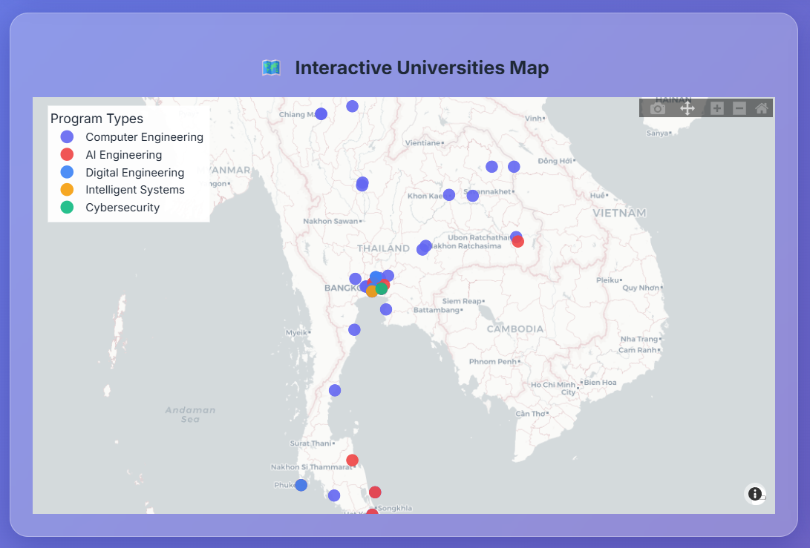
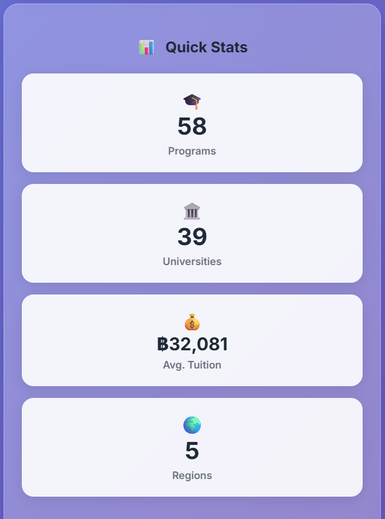
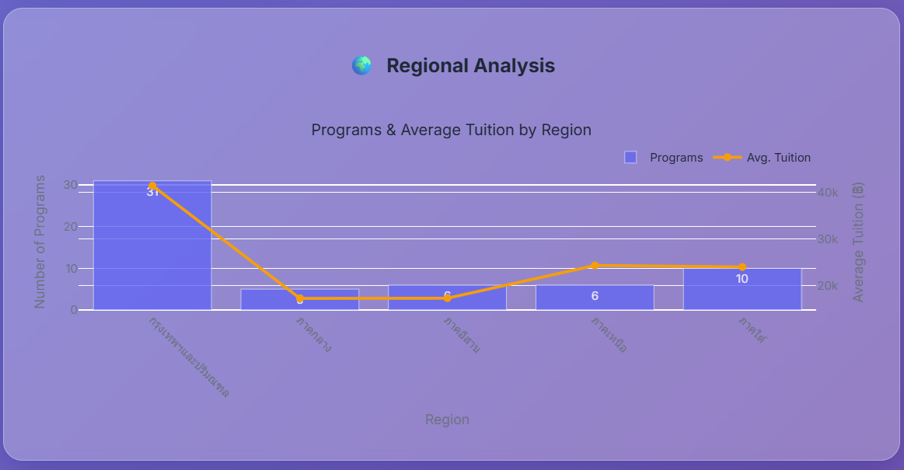
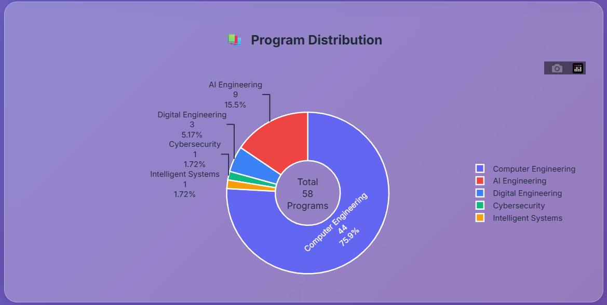
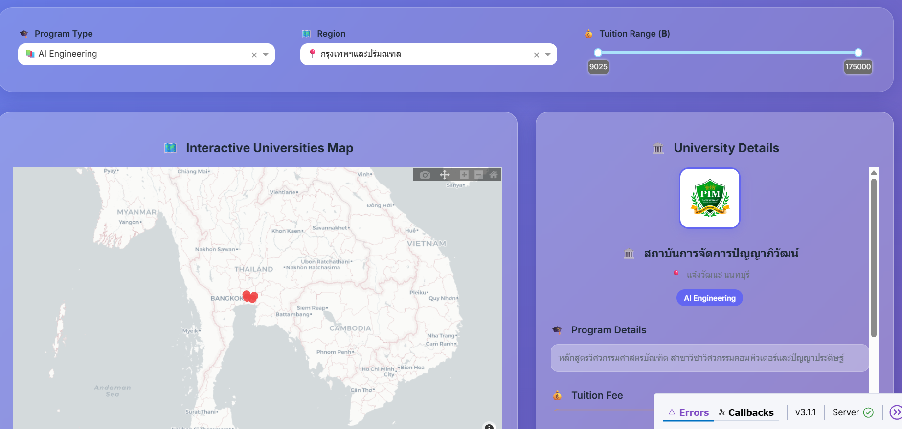
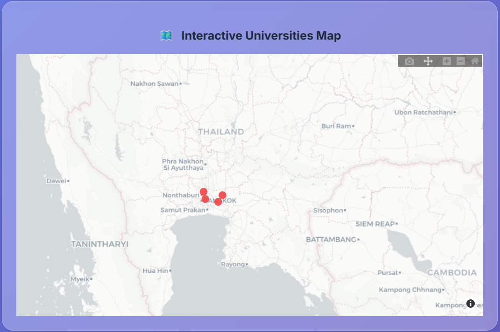

# 🇹🇭 Thailand Computer & AI Engineering Universities Dashboard

Dashboard สำหรับค้นหาและเปรียบเทียบหลักสูตรวิศวกรรมคอมพิวเตอร์และปัญญาประดิษฐ์ในประเทศไทย

## 📁 โครงสร้างไฟล์

```
project/
├── main.py              # ไฟล์หลักของแอป
├── config.py            # การตั้งค่าและสี
├── data_utils.py        # ฟังก์ชันจัดการข้อมูล
├── layout.py            # ส่วนประกอบของหน้าเว็บ
├── charts.py            # ฟังก์ชันสร้างกราฟ
├── callbacks.py         # ฟังก์ชัน Callback สำหรับ Dash
├── requirements.txt     # Dependencies
├── assets/
│   └── custom.css       # CSS สำหรับการจัดแต่ง
└── data/
    └── data_via_location_noises.csv  # ข้อมูลมหาวิทยาลัย
```

## 🚀 การติดตั้งและใช้งาน

### 1. ติดตั้ง Dependencies

```bash
pip install -r requirements.txt
```

### 2. เตรียมข้อมูล

ให้แน่ใจว่าไฟล์ `data/data_via_location_noises.csv` มีอยู่และมีคอลัมน์ที่จำเป็น:

* `มหาวิทยาลัย` - ชื่อมหาวิทยาลัย
* `หลักสูตร` - ชื่อหลักสูตร
* `วิทยาเขต` - ชื่อวิทยาเขต
* `ค่าใช้จ่ายที่ปรับแล้ว` - ค่าเล่าเรียน
* `latitude`, `longitude` - พิกัดมหาวิทยาลัย

### 3. รันแอป

```bash
python main.py
```

แอปจะรันที่ `http://127.0.0.1:8050` หรือ `http://localhost:8050`

## 📊 ฟีเจอร์หลัก

### 🗺️ แผนที่แบบ Interactive

* แสดงตำแหน่งมหาวิทยาลัยบนแผนที่ประเทศไทย
* คลิกเพื่อดูรายละเอียดแต่ละมหาวิทยาลัย
* สีแยกตามประเภทโปรแกรม

### 🔍 ระบบกรองข้อมูล

* กรองตามประเภทโปรแกรม
* กรองตามภูมิภาค
* กรองตามช่วงค่าเล่าเรียน

### 📈 กราฟวิเคราะห์

* การเปรียบเทียบภูมิภาค
* การกระจายประเภทโปรแกรม
* สถิติด่วนและข้อมูลเชิงลึก

## 🎨 การปรับแต่ง

### เปลี่ยนสีธีม

แก้ไขไฟล์ `config.py` ส่วน `COLORS`:

```python
COLORS = {
    'primary': '#6366f1',    # สีหลัก
    'secondary': '#64748b',  # สีรอง
    # ... สีอื่นๆ
}
```

### เพิ่มประเภทโปรแกรมใหม่

แก้ไขฟังก์ชัน `categorize_program()` ในไฟล์ `data_utils.py`:

```python
def categorize_program(program_name):
    if 'คำสำคัญใหม่' in str(program_name):
        return 'ประเภทใหม่'
    # ... เงื่อนไขอื่นๆ
```

### เปลี่ยนการตั้งค่าแผนที่

แก้ไขไฟล์ `config.py` ส่วน `MAP_CONFIG`:

```python
MAP_CONFIG = {
    'center_lat': 13.5,    # จุดกึ่งกลางแผนที่
    'center_lon': 101.0,   # จุดกึ่งกลางแผนที่
    'zoom': 4.8,           # ระดับการซูม
    'style': 'carto-positron'  # สไตล์แผนที่
}
```

## 🛠️ การพัฒนาต่อ

### เพิ่มฟีเจอร์ใหม่

1. เพิ่มฟังก์ชันใน `charts.py` สำหรับกราหใหม่
2. เพิ่ม component ใน `layout.py`
3. เพิ่ม callback ใน `callbacks.py`

### เปลี่ยนแหล่งข้อมูล

แก้ไขไฟล์ `config.py` ส่วน `DATA_CONFIG`

project/
├── main.py              # ไฟล์หลักของแอป
├── config.py            # การตั้งค่าและสี
├── data_utils.py        # ฟังก์ชันจัดการข้อมูล
├── layout.py            # ส่วนประกอบของหน้าเว็บ
├── charts.py            # ฟังก์ชันสร้างกราฟ
├── callbacks.py         # ฟังก์ชัน Callback สำหรับ Dash
├── requirements.txt     # Dependencies
├── run_app.py           # ไฟล์รันแอปแบบทางเลือก
├── assets/
│   └── custom.css       # CSS สำหรับการจัดแต่ง
├── data/
     └── data_via_location_noises.csv  # ข้อมูลมหาวิทยาลัย

```

## 🚀 การติดตั้งและใช้งาน

### 1. ติดตั้ง Dependencies

```bash
pip install -r requirements.txt
```

### 2. เตรียมข้อมูล

ให้แน่ใจว่าไฟล์ `data/data_via_location_noises.csv` มีอยู่และมีคอลัมน์ที่จำเป็น:

* `มหาวิทยาลัย` - ชื่อมหาวิทยาลัย
* `หลักสูตร` - ชื่อหลักสูตร
* `วิทยาเขต` - ชื่อวิทยาเขต
* `ค่าใช้จ่ายที่ปรับแล้ว` - ค่าเล่าเรียน
* `latitude`, `longitude` - พิกัดมหาวิทยาลัย

### 3. รันแอป

```bash
python main.py
```

หรือหากมีปัญหาเรื่องพอร์ต:

```bash
python run_app.py
```

แอปจะรันที่ `http://127.0.0.1:8050` หรือ `http://localhost:8050`

## 🎯 คู่มือการใช้งาน Dashboard

### 🏠 ส่วนหัว (Header Section)


* **ชื่อ Dashboard** : แสดงชื่อและโลโก้ของระบบ
* **คำอธิบาย** : บรรยายสั้นๆ เกี่ยวกับฟังก์ชันของ Dashboard

### 🔧 ระบบกรองข้อมูล (Filter Controls)


#### 1. 🎓 Program Type Filter

* **ฟังก์ชัน** : เลือกประเภทหลักสูตรที่ต้องการดู
* **ตัวเลือก** :
* All Programs - แสดงทุกหลักสูตร
* AI Engineering - วิศวกรรมปัญญาประดิษฐ์
* Digital Engineering - วิศวกรรมดิจิทัล
* Intelligent Systems - ระบบอัจฉริยะ
* Cybersecurity - ความปลอดภัยไซเบอร์
* Computer Engineering - วิศวกรรมคอมพิวเตอร์ทั่วไป

#### 2. 🗺️ Region Filter

* **ฟังก์ชัน** : เลือกภูมิภาคที่ต้องการดู
* **ตัวเลือก** :
* All Regions - ทุกภูมิภาค
* ภาคเหนือ - มหาวิทยาลัยในภาคเหนือ
* ภาคอีสาน - มหาวิทยาลัยในภาคอีสาน
* ภาคกลาง - มหาวิทยาลัยในภาคกลาง
* ภาคใต้ - มหาวิทยาลัยในภาคใต้
* กรุงเทพฯและปริมณฑล - มหาวิทยาลัยในเขตกรุงเทพฯ

#### 3. 💰 Tuition Range Slider

* **ฟังก์ชัน** : กำหนดช่วงค่าเล่าเรียนที่ต้องการ
* **การใช้งาน** : ลากจุดทั้งสองข้างเพื่อกำหนดช่วงราคาต่ำสุดและสูงสุด
* **แสดงผล** : แสดงค่าในหน่วยพันบาท (K) และมี tooltip แสดงค่าแม่นยำ

### 🗺️ แผนที่แบบ Interactive (Interactive Map)



#### ฟีเจอร์หลัก:

* **📍 จุดบนแผนที่** : แต่ละจุดแทนมหาวิทยาลัย สีแตกต่างตามประเภทหลักสูตร
* **🖱️ Click Event** : คลิกที่จุดเพื่อดูรายละเอียดมหาวิทยาลัย
* **🔍 Zoom** : ซูมเข้า-ออกได้เพื่อดูรายละเอียดในแต่ละพื้นที่
* **📋 Legend** : แสดงสีและความหมายของแต่ละประเภทหลักสูตร
* **ℹ️ Hover Info** : เลื่อนเมาส์ไปที่จุดเพื่อดูข้อมูลพื้นฐาน

#### สีของจุดบนแผนที่:

* 🔵  **สีน้ำเงิน** : Computer Engineering
* 🔴  **สีแดง** : AI Engineering
* 🟢  **สีเขียว** : Cybersecurity
* 🟡  **สีเหลือง** : Intelligent Systems
* 🟠  **สีส้ม** : Digital Engineering

### 🏛️ รายละเอียดมหาวิทยาลัย (University Details)


#### ข้อมูลที่แสดง:

1. **🖼️ โลโก้มหาวิทยาลัย** : รูปโลโก้หรือสัญลักษณ์ของมหาวิทยาลัย
2. **🏛️ ชื่อมหาวิทยาลัย** : ชื่อเต็มของสถาบัน
3. **📍 วิทยาเขต** : สาขาหรือวิทยาเขตที่เปิดสอนหลักสูตร
4. **🏷️ ป้ายประเภทหลักสูตร** : แสดงประเภทหลักสูตรด้วยสีที่โดดเด่น
5. **🎓 รายละเอียดหลักสูตร** : ชื่อเต็มของหลักสูตรและรายละเอียด
6. **💰 ค่าเล่าเรียน** : แสดงค่าใช้จ่ายต่อภาคการศึกษาหรือปี
7. **📚 หลักสูตรอื่นๆ** : หลักสูตรอื่นที่มหาวิทยาลัยเดียวกันเปิดสอน
8. **📊 ข้อมูลเพิ่มเติม** : ภูมิภาคและอันดับในระบบ

#### การใช้งาน:

* คลิกที่จุดใดๆ บนแผนที่เพื่อดูรายละเอียด
* ข้อมูลจะอัปเดตแบบ real-time ตามการกรอง
* สามารถเลื่อนดูข้อมูลได้หากมีเนื้อหามาก

### 📊 ส่วนสถิติด่วน (Quick Statistics)



#### เมตริกหลัก:

1. **🎓 Total Programs** : จำนวนหลักสูตรทั้งหมดที่ตรงกับเงื่อนไขการกรอง
2. **🏛️ Total Universities** : จำนวนมหาวิทยาลัยที่มีหลักสูตรตรงตามเงื่อนไข
3. **💰 Average Tuition** : ค่าเล่าเรียนเฉลี่ยของหลักสูตรที่แสดง
4. **🌍 Regions** : จำนวนภูมิภาคที่มีหลักสูตรตรงตามเงื่อนไข

#### ข้อมูลเชิงลึกค่าเล่าเรียน:

* **🔻 Lowest** : ค่าเล่าเรียนต่ำสุด (สีเขียว)
* **🔺 Highest** : ค่าเล่าเรียนสูงสุด (สีแดง)

#### 🏆 อันดับมหาวิทยาลัยยอดนิยม:

* แสดง 3 อันดับแรกของมหาวิทยาลัยที่มีหลักสูตรมากที่สุด
* แสดงจำนวนหลักสูตรของแต่ละสถาบัน

### 📈 กราฟวิเคราะห์ข้อมูล (Analytics Charts)

#### 1. 🌍 Regional Analysis Chart



* **ประเภทกราฟ** : Bar Chart + Line Chart แบบ Dual-Axis
* **แกน Y ซ้าย** : จำนวนหลักสูตรในแต่ละภูมิภาค (แท่งสีน้ำเงิน)
* **แกน Y ขวา** : ค่าเล่าเรียนเฉลี่ยในแต่ละภูมิภาค (เส้นสีส้ม)
* **การใช้งาน** : เปรียบเทียบจำนวนหลักสูตรและค่าใช้จ่ายระหว่างภูมิภาค
* **Hover Info** : แสดงค่าแม่นยำเมื่อเลื่อนเมาส์

#### 2. 📚 Program Distribution Chart



* **ประเภทกราฟ** : Donut Chart (วงกลมกลวง)
* **แสดงข้อมูล** : สัดส่วนของแต่ละประเภทหลักสูตร
* **สีของกราฟ** : ใช้สีเดียวกับจุดบนแผนที่
* **ตรงกลาง** : แสดงจำนวนหลักสูตรทั้งหมด
* **Legend** : แสดงรายชื่อประเภทหลักสูตรด้านข้าง
* **Interactive** : คลิกที่ legend เพื่อซ่อน/แสดงข้อมูล

## 💡 เทคนิคการใช้งานขั้นสูง

### 🎯 การค้นหาแบบเจาะจง



1. **ค้นหาหลักสูตร AI ในกรุงเทพฯ** :

* เลือก Program Type: "AI Engineering"
* เลือก Region: "กรุงเทพฯและปริมณฑล"

1. **หาหลักสูตรราคาไม่เกิน 100,000 บาท** :

* ลากแถบ Tuition Slider ให้ค่าสูงสุดไม่เกิน 100K

1. **เปรียบเทียบหลักสูตรในภูมิภาคต่างๆ** :

* ดูกราฟ Regional Analysis เพื่อเปรียบเทียบ

### 🔄 การใช้งานแบบ Interactive



* **Zoom แผนที่** : ใช้เมาส์ wheel หรือปุ่ม +/-
* **Pan แผนที่** : คลิกลากเพื่อเลื่อนแผนที่
* **Reset View** : ดับเบิลคลิกบนแผนที่เพื่อกลับสู่มุมมองเริ่มต้น
* **Legend Control** : คลิกที่รายการใน Legend เพื่อซ่อน/แสดงข้อมูล

## 🔧 การปรับแต่งและพัฒนาต่อ

### 🎨 การเปลี่ยนธีมสี

แก้ไขไฟล์ `config.py` ส่วน `COLORS`:

```python
COLORS = {
    'primary': '#6366f1',    # สีหลัก - น้ำเงิน
    'secondary': '#64748b',  # สีรอง - เทา
    'success': '#10b981',    # สีเขียว - สำหรับข้อมูลเชิงบวก
    'danger': '#ef4444',     # สีแดง - สำหรับข้อมูลที่ต้องระวัง
    'warning': '#f59e0b',    # สีส้ม/เหลือง - สำหรับคำเตือน
    # ... สีอื่นๆ
}
```

### 📊 การเพิ่มประเภทโปรแกรมใหม่

แก้ไขฟังก์ชัน `categorize_program()` ในไฟล์ `data_utils.py`:

```python
def categorize_program(program_name):
    program_name = str(program_name)
  
    # เพิ่มประเภทใหม่
    if any(word in program_name for word in ['IoT', 'Internet of Things']):
        return 'IoT Engineering'
    elif any(word in program_name for word in ['Blockchain', 'บล็อกเชน']):
        return 'Blockchain Technology'
    # ... เงื่อนไขเดิม
```

### 🗺️ การปรับแต่งแผนที่

แก้ไขไฟล์ `config.py` ส่วน `MAP_CONFIG`:

```python
MAP_CONFIG = {
    'center_lat': 13.5,           # จุดกึ่งกลางแผนที่ (ละติจูด)
    'center_lon': 101.0,          # จุดกึ่งกลางแผนที่ (ลองจิจูด)
    'zoom': 4.8,                  # ระดับการซูมเริ่มต้น
    'style': 'carto-positron',    # สไตล์แผนที่
    'marker_size': 14             # ขนาดของจุดบนแผนที่
}
```

 **สไตล์แผนที่ที่ใช้ได้** :

* `carto-positron` - สีขาวสะอาด (แนะนำ)
* `carto-darkmatter` - สีดำสำหรับโหมดมืด
* `open-street-map` - แผนที่แบบดั้งเดิม
* `satellite` - ภาพถ่ายดาวเทียม

### 🎛️ การเพิ่มฟีเจอร์ใหม่

#### ตัวอย่าง: เพิ่มการค้นหาด้วยชื่อมหาวิทยาลัย

1. **เพิ่ม Search Box ในไฟล์ `layout.py`** :

```python
# เพิ่มใน create_filters()
dcc.Input(
    id='university-search',
    type='text',
    placeholder='🔍 ค้นหาชื่อมหาวิทยาลัย...',
    style={'width': '100%', 'padding': '10px', 'borderRadius': '8px'}
)
```

2. **เพิ่ม Callback ในไฟล์ `callbacks.py`** :

```python
@app.callback(
    Output('filtered-data', 'data'),
    [Input('university-search', 'value')]
)
def filter_by_university_name(search_term):
    if search_term:
        return df_clean[df_clean['มหาวิทยาลัย'].str.contains(search_term, na=False)]
    return df_clean
```

#### 1. แอปไม่รัน / เกิด Error


 **วิธีแก้** :

```bash
# ตรวจสอบ Python version
python --version

# ติดตั้ง dependencies ใหม่
pip install -r requirements.txt --upgrade

# รันด้วยไฟล์ทางเลือก
python run_app.py
```

#### 2. ข้อมูลไม่แสดงบนแผนที่

* **ตรวจสอบ** : ไฟล์ CSV มีคอลัมน์ `latitude`, `longitude` หรือไม่
* **ตรวจสอบ** : ค่าพิกัดอยู่ในช่วงของประเทศไทยหรือไม่
* **แก้ไข** : ลองกรองข้อมูลใหม่หรือ Reset filters

#### 3. กราฟไม่แสดงผล

* **ตรวจสอบ** : Browser รองรับ JavaScript หรือไม่
* **แก้ไข** : ลอง Refresh หน้าเว็บ หรือเปลี่ยน Browser

### 🔧 การ Debug

เพิ่มโค้ดนี้ในไฟล์ `main.py` เพื่อแสดงข้อมูล Debug:

```python
if __name__ == '__main__':
    print(f"📊 จำนวนข้อมูลทั้งหมด: {len(df_clean)} รายการ")
    print(f"🏛️ จำนวนมหาวิทยาลัย: {df_clean['มหาวิทยาลัย'].nunique()} แห่ง")
    print(f"🌍 ภูมิภาคที่มีข้อมูล: {df_clean['region'].unique()}")
    app.run(debug=True, host='127.0.0.1', port=8050)
```

## 📝 การใช้งานข้อมูลจริง

### 📋 รูปแบบไฟล์ CSV ที่ต้องการ


```csv
มหาวิทยาลัย,หลักสูตร,วิทยาเขต,ค่าใช้จ่ายที่ปรับแล้ว,latitude,longitude
จุฬาลงกรณ์มหาวิทยาลัย,วิศวกรรมคอมพิวเตอร์,ปทุมวัน,45000,13.7563,100.5018
มหาวิทยาลัยเทคนิคเอเชีย,วิศวกรรมปัญญาประดิษฐ์,รังสิต,38000,14.0208,100.6106
```

### 🔄 การอัปเดตข้อมูล

1. **แทนที่ไฟล์ CSV** : วางไฟล์ใหม่ในโฟลเดอร์ `data/`
2. **Restart แอป** : ปิดและเปิดแอปใหม่
3. **ตรวจสอบ** : ดูว่าข้อมูลโหลดถูกต้องหรือไม่

---

**🙏 ขอบคุณที่ใช้งาน Thailand Universities Dashboard!**

หากมีคำถามหรือต้องการความช่วยเหลือเพิ่มเติม สามารถสร้าง Issue หรือติดต่อผู้พัฒนาได้เลยครับ
