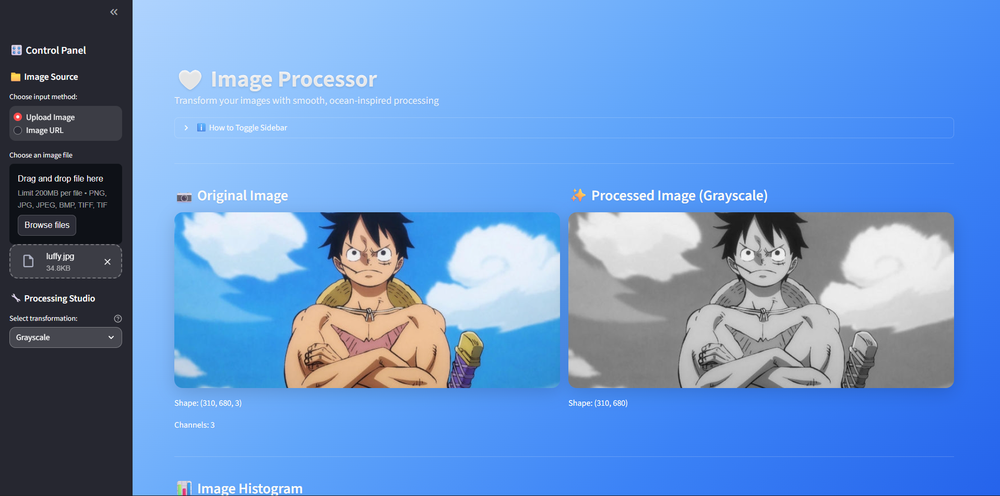
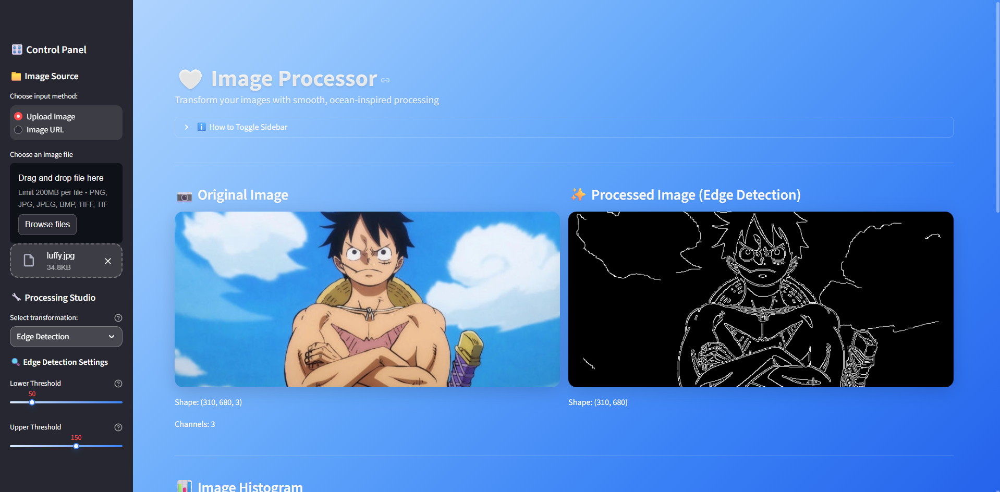
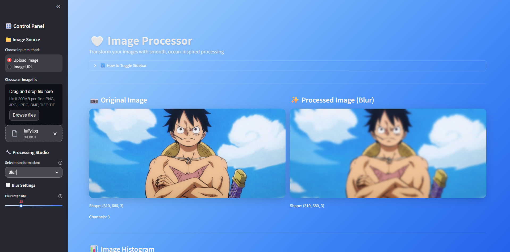
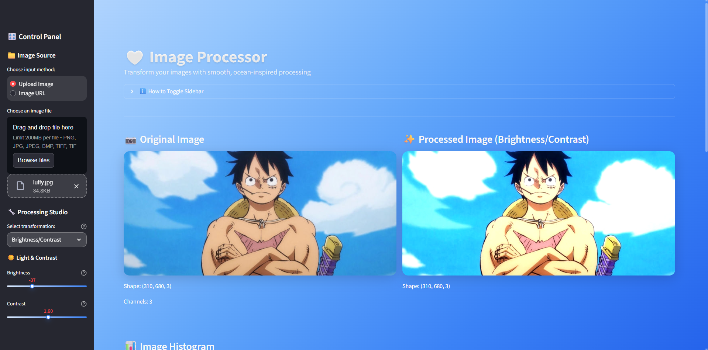
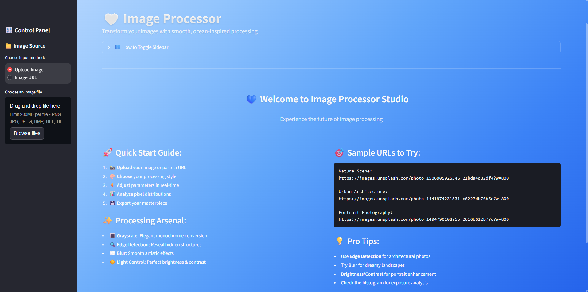
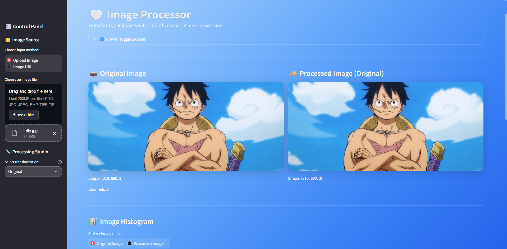
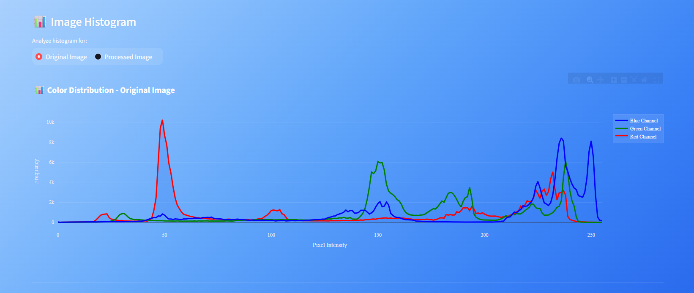
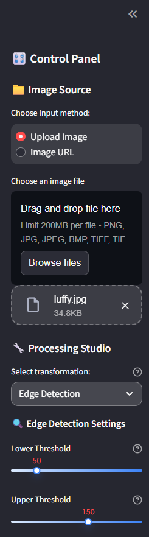

# 💙 โปรแกรมประมวลผลภาพ

ชื่อ: นายวรากร หนูผุด
รหัสนักศึกษา: 6510110427

## ✨ คุณสมบัติหลัก

### 📸 **แหล่งรับภาพหลากหลาย**

* **อัปโหลดไฟล์** : รองรับไฟล์ PNG, JPG, JPEG, BMP, TIFF
* **URL จากอินเทอร์เน็ต** : โหลดภาพจาก URL ใดก็ได้บนเว็บ
* **เว็บแคมและกล้อง** : ถ่ายภาพโดยตรงจากกล้องของอุปกรณ์
* **ลากและวาง** : อินเทอร์เฟซการอัปโหลดที่ง่ายดาย

### 🔧 **เครื่องมือประมวลผลภาพ**

* **แปลงขาวดำ** : เปลี่ยนภาพสีเป็นโทนสีเทาที่สวยงาม
* **ตรวจจับขอบ** : ใช้ Canny edge detection พร้อมการปรับแต่งค่าได้
* **เบลอแบบ Gaussian** : สร้างเอฟเฟกต์เบลอนุ่มนวลปรับระดับได้
* **ควบคุมความสว่าง-คอนทราสต์** : ปรับแต่งแสงและความคมชัดของภาพ

### 🎛️ **ส่วนควบคุม GUI แบบโต้ตอบ**

* **ปรับค่าแบบเรียลไทม์** : ดูผลลัพธ์ทันทีเมื่อเปลี่ยนค่า
* **สไลเดอร์ควบคุม** : ปรับแต่งพารามิเตอร์แบบง่ายๆ
* **เลือกการประมวลผล** : เมนูแบบเลื่อนลงสำหรับเอฟเฟกต์ต่างๆ
* **อินเทอร์เฟซปรับตัวได้** : ใช้งานได้ทั้งคอมพิวเตอร์และมือถือ

### 📊 **การแสดงผลและการวิเคราะห์**

* **เปรียบเทียบแบบเคียงข้าง** : แสดงภาพต้นฉบับและภาพที่ประมวลผลแล้ว
* **ฮิสโทแกรมแบบโต้ตอบ** : วิเคราะห์การกระจายสีด้วย Plotly
* **สถิติภาพ** : วิเคราะห์ค่าพิกเซลอย่างครอบคลุม
* **วิเคราะห์ช่องสี** : แยกวิเคราะห์ช่องสี RGB แต่ละช่อง

### 📈 **การแสดงข้อมูลเป็นกราฟ**

* **กราฟการกระจายสี** : ฮิสโทแกรมแบบโต้ตอบแสดงการกระจายความเข้มของพิกเซล
* **วิเคราะห์หลายช่องสี** : แสดงแยกสำหรับช่องสีแดง เขียว น้ำเงิน
* **ฮิสโทแกรมขาวดำ** : การกระจายความเข้มสำหรับภาพขาวดำ
* **อัปเดตเรียลไทม์** : กราฟเปลี่ยนแปลงอัตโนมัติตามการประมวลผล

### ขั้นตอนการใช้งานพื้นฐาน

1. **อัปโหลดภาพ** : เลือกจากไฟล์ในเครื่องหรือใส่ URL ภาพ
2. **เลือกการประมวลผล** : เลือกจากตัวเลือกประมวลผลภาพที่มี
3. **ปรับพารามิเตอร์** : ใช้สไลเดอร์เพื่อปรับแต่งการตั้งค่า
4. **ดูผลลัพธ์** : เปรียบเทียบภาพต้นฉบับและภาพที่ประมวลผลแล้ว
5. **วิเคราะห์ข้อมูล** : ตรวจสอบฮิสโทแกรมและสถิติ
6. **ส่งออก** : ดาวน์โหลดภาพที่ประมวลผลแล้ว

### ตัวเลือกการประมวลผล

#### 🔳 Grayscale

แปลงภาพสีเป็นโทนสีเทาโดยคงข้อมูลความสว่างไว้

#### 🔍 Edge Detection

* **เกณฑ์ต่ำ** : `0-255` (ค่าเริ่มต้น: 50)
* **เกณฑ์สูง** : `0-255` (ค่าเริ่มต้น: 150)
* ใช้อัลกอริทึม Canny edge detection สำหรับการระบุขอบที่แม่นยำ

#### 🌫️ Blur

* **ระดับการเบลอ** : `1-51` (ค่าเริ่มต้น: 15, เลขคี่เท่านั้น)
* ใช้ตัวกรอง Gaussian blur สำหรับเอฟเฟกต์ศิลปะที่นุ่มนวล

#### ☀️ Bightness & Contrasts

* **ความสว่าง** : `-100 ถึง +100` (ค่าเริ่มต้น: 0)
* **คอนทราสต์** : `0.1 ถึง 3.0` (ค่าเริ่มต้น: 1.0)
* ปรับความสว่างและคอนทราสต์ของภาพแบบเรียลไทม์

## 📱 UX/UI

### 🎛️ แผงควบคุม (Sidebar)

* **การเลือกแหล่งภาพ** : ตัวเลือกอัปโหลดหรือใส่ URL
* **ควบคุมการประมวลผล** : สไลเดอร์และเมนูเลือกพารามิเตอร์
* **ข้อมูลช่วยเหลือ** : คำแนะนำการสลับและเทคนิคต่างๆ

### 📊 แดชบอร์ดหลัก

* **การแสดงภาพ** : เปรียบเทียบภาพต้นฉบับและภาพที่ประมวลผลแล้ว
* **การแสดงฮิสโทแกรม** : กราฟการกระจายสีแบบโต้ตอบ
* **แผงสถิติ** : การวิเคราะห์ภาพอย่างละเอียด
* **ควบคุมการส่งออก** : ปุ่มดาวน์โหลดสำหรับภาพที่ประมวลผลแล้ว

### 🌊 คุณสมบัติการออกแบบ

* **ธีม Liquid Blue** : พื้นหลังไล่ระดับสีที่ทันสมัยด้วยแรงบันดาลใจจากมหาสมุทร
* **เอฟเฟกต์ Glassmorphism** : องค์ประกอบ UI แบบกระจกฝ้าพร้อม backdrop blur
* **แอนิเมชันนุ่มนวล** : องค์ประกอบลอยและการเปลี่ยนแปลงเมื่อวางเมาส์
* **สุนทรียศาสตร์ Apple iOS** : ภาษาการออกแบบที่สะอาดและเรียบง่าย

## 📊 การวิเคราะห์ข้อมูล

### สถิติภาพ

* **ค่าเฉลี่ยพิกเซล** : ความเข้มเฉลี่ยทุกช่องสี
* **ส่วนเบี่ยงเบนมาตรฐาน** : วัดการกระจายของค่าพิกเซล
* **ค่าต่ำสุด/สูงสุด** : ช่วงของความเข้มพิกเซล
* **การวิเคราะห์ช่องสี** : สถิติช่องสี RGB แต่ละช่อง

### ฮิสโทแกรมแบบโต้ตอบ

* **แกน X** : ความเข้มพิกเซล (0-255)
* **แกน Y** : จำนวนความถี่
* **หลายช่องสี** : แสดงแยกสำหรับช่องสี RGB
* **อัปเดตเรียลไทม์** : รีเฟรชอัตโนมัติเมื่อเปลี่ยนพารามิเตอร์

## 🎨 ภาพหน้าจอ

### หน้าหลัก

*ส่วนติดต่อผู้ใช้หลักพร้อมธีมสีน้ำเงิน*

### การประมวลผลภาพ

*การเปรียบเทียบภาพต้นฉบับและภาพที่ประมวลผลแล้วแบบเคียงข้าง*

### การวิเคราะห์ฮิสโทแกรม

*การแสดงการกระจายสีแบบโต้ตอบ*

### ส่วนควบคุมพารามิเตอร์

*Sidebar พร้อมควบคุมพารามิเตอร์การประมวลผล*

*สร้างโดยใช้ Streamlit และ OpenCV*
